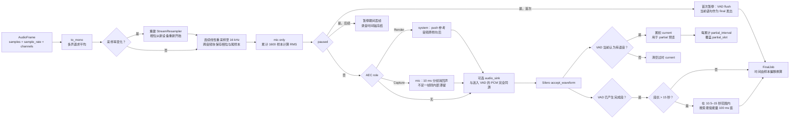
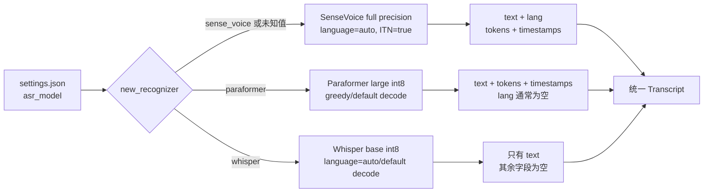
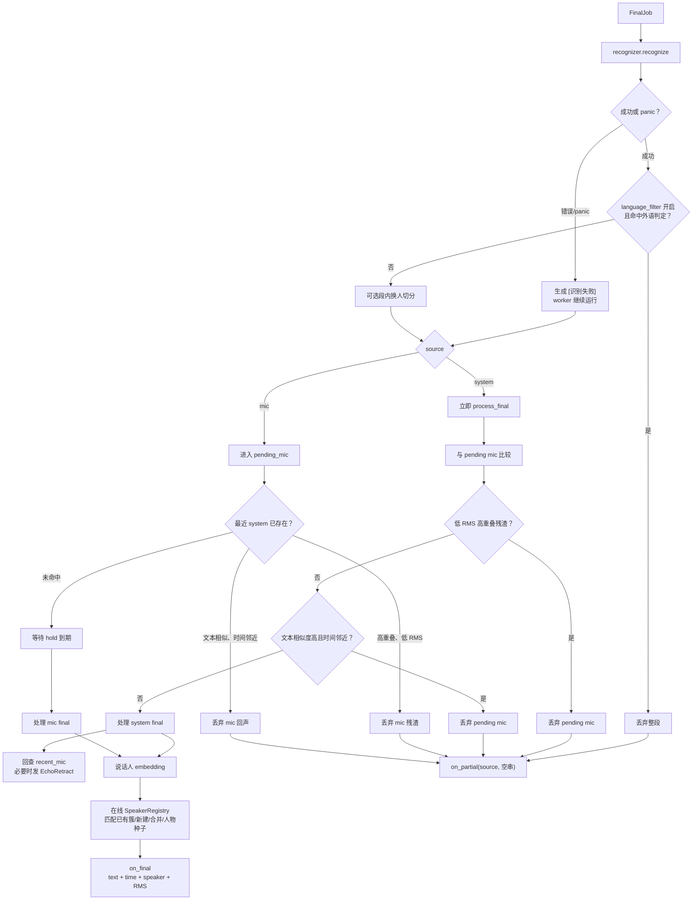
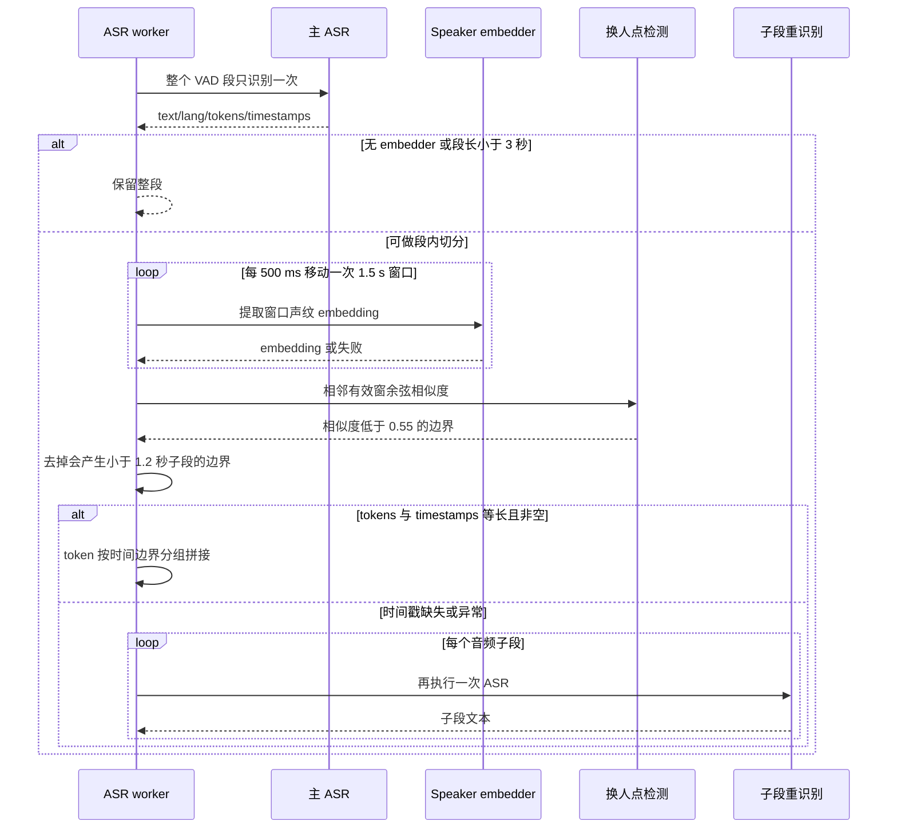
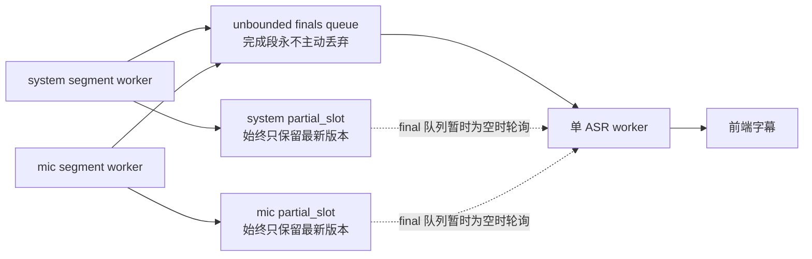
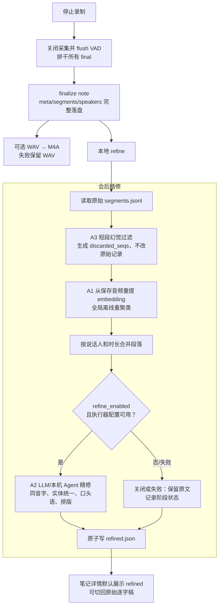
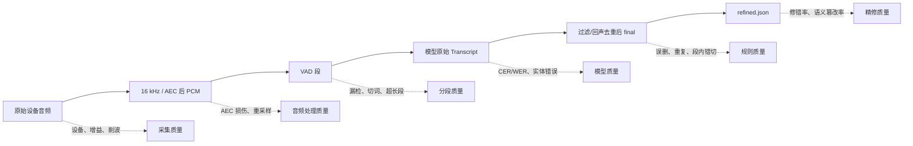

# ASR 全链路流程图

本文描述当前实现中的实时 ASR（Automatic Speech Recognition，自动语音识别）链路，以及停止录制后的精修链路。

## 1. 端到端总览

```mermaid
flowchart TB
    subgraph Input["音频输入层"]
        MIC["麦克风输入<br/>CPAL 或 macOS VPIO"]
        SYS["系统音频<br/>ScreenCaptureKit"]
    end

    subgraph Normalize["统一音频格式与回声处理"]
        MICMONO["转单声道"]
        SYSMONO["转单声道"]
        MICRS["流式重采样<br/>设备采样率 → 16 kHz"]
        SYSRS["流式重采样<br/>设备采样率 → 16 kHz"]
        LEVEL["麦克风电平统计<br/>AEC 前 RMS，100 ms 上报"]
        AECREF["AEC Render<br/>系统声作为远端参考"]
        AECCAP["AEC Capture<br/>消除麦克风中的外放回声"]
    end

    subgraph PerSource["每个音源独立的 segment worker"]
        PAUSE{"是否暂停？"}
        SINK["可选音频旁路<br/>写入 16 kHz WAV"]
        VAD["Silero VAD<br/>语音检测与断句"]
        FINISHED["完成段 FinalJob<br/>source + PCM + start/end"]
        PARTIAL["在途段 PartialJob<br/>每源覆盖式最新槽"]
    end

    subgraph ASRWorker["单 ASR worker：final 优先，空闲处理 partial"]
        PICK["串行取任务"]
        REC["选定识别器推理<br/>SenseVoice / Paraformer / Whisper"]
        RESULT["Transcript<br/>text + lang + tokens + timestamps"]
        LANG{"语言过滤命中？"}
        SPLIT{"段长 ≥ 3 秒<br/>且声纹模型可用？"}
        CHANGE["1.5 秒声纹滑窗<br/>检测段内换人点"]
        TOKENS{"token 时间戳可用？"}
        GROUP["按换人边界分配 tokens"]
        REASR["按音频子段重新 ASR"]
        SUBS["一个或多个 SubFinal"]
    end

    subgraph Guard["跨音源过滤与说话人处理"]
        SOURCE{"音源"}
        SYSFLOW["系统声立即处理<br/>登记 recent_system"]
        MICHOLD["麦克风段暂存<br/>默认 2.5 秒；系统 partial 在途时最长约 15 秒"]
        ECHO{"与系统声时间邻近<br/>且文本相似度 ≥ 0.6？"}
        RESIDUE{"与系统声重叠 ≥ 80%<br/>且 mic RMS ≤ 0.012？"}
        DIAR["提取说话人 embedding<br/>在线聚类/身份匹配"]
        FINAL["FinalSegment 事件"]
        DROP["丢弃文本段<br/>并清空对应 partial"]
        RETRACT["必要时追溯撤回<br/>已放行的 mic 回声段"]
    end

    subgraph Persist["实时结果消费"]
        ACTOR["Lifecycle actor"]
        DISK["追加 segments.jsonl<br/>更新 speakers.json / meta.json"]
        UI["发送前端事件<br/>实时字幕与说话人标签"]
        LIVE["CLI / MCP<br/>读取实时转写"]
    end

    MIC --> MICMONO --> MICRS --> LEVEL --> AECCAP
    SYS --> SYSMONO --> SYSRS --> AECREF
    AECREF -. "共享远端参考" .-> AECCAP
    AECREF --> PAUSE
    AECCAP --> PAUSE
    PAUSE -- "是：丢帧；首次进入时 flush 在途句" --> FINISHED
    PAUSE -- "否" --> SINK --> VAD
    VAD -- "句尾/15 秒硬切/停止 flush" --> FINISHED
    VAD -- "当前尚未结束的句子" --> PARTIAL
    FINISHED --> PICK
    PARTIAL -. "ASR 空闲时 best-effort 预览" .-> PICK
    PICK --> REC --> RESULT --> LANG
    LANG -- "是：日/韩标签或假名/谚文占比过高" --> DROP
    LANG -- "否" --> SPLIT
    SPLIT -- "否" --> SUBS
    SPLIT -- "是" --> CHANGE --> TOKENS
    TOKENS -- "是" --> GROUP --> SUBS
    TOKENS -- "否" --> REASR --> SUBS
    SUBS --> SOURCE
    SOURCE -- "system" --> SYSFLOW --> DIAR
    SOURCE -- "mic" --> MICHOLD --> ECHO
    ECHO -- "是" --> DROP
    ECHO -- "否" --> RESIDUE
    RESIDUE -- "是" --> DROP
    RESIDUE -- "否" --> DIAR
    SYSFLOW -. "新 system final 回查最近 30 秒 mic" .-> RETRACT
    RETRACT --> DROP
    DIAR --> FINAL --> ACTOR
    ACTOR --> DISK
    ACTOR --> UI
    ACTOR --> LIVE
```

## 2. 单音源采集、重采样与 VAD 细节

Silero 当前固定参数：

| 参数 | 当前值 | 作用 |
|---|---:|---|
| 采样率 | 16 kHz | 所有 ASR/VAD 的统一输入格式 |
| `threshold` | 0.5 | 高于阈值视为语音 |
| `min_speech_duration` | 0.25 s | 更短活动不构成有效语音段 |
| `min_silence_duration` | 0.6 s | 连续静音超过该值结束一句 |
| `max_speech_duration` | 15 s | 超长独白的目标上限；代码另做硬切兜底 |
| `window_size` | 512 samples | VAD 推理窗口 |

## 3. 识别器选择与输出差异

| 能力 | SenseVoice | Paraformer | Whisper base |
|---|---|---|---|
| 默认选择 | 是 | 否 | 否 |
| 模型精度 | 全精度优先，int8 兜底 | int8 | int8 优先 |
| 中文 | 支持 | 中文专用 | 支持 |
| 中英混合 | 自动语种 | 英文较弱 | 自动语种 |
| 语言标签 | 有 | 通常无 | 当前适配层未透传 |
| token 时间戳 | 有 | 有 | 当前适配层未透传 |
| 段内换人后的文本处理 | 按 token 分组 | 按 token 分组 | 子段重新识别 |
| 热词/领域词 | 未接入 | 未接入 | 未接入 |

## 4. Final 段处理与所有丢弃路径

### 语言过滤

开启时满足任一条件便丢弃整个 final：

- SenseVoice 语言标签为 `ja` 或 `ko`；
- 文本字母类字符中，假名或谚文比例大于 30%。

### 回声与残渣过滤

| 规则 | 当前条件 | 动作 |
|---|---|---|
| 文本回声 | 时间区间重叠，或起点差小于 2.5 秒；同时文本相似度 ≥ 0.6 | 丢弃 mic 段 |
| AEC 残渣 | mic 段与 system 段重叠比例 ≥ 0.8，且 mic RMS ≤ 0.012 | 丢弃 mic 段 |
| 追溯撤回 | system final 到达后，在最近 30 秒已放行 mic 中发现回声 | 从落盘和 UI 撤回精确匹配段 |

## 5. 段内说话人切分

## 6. 实时 partial 与 final 的调度关系

- final 使用队列，设计目标是不丢完成句。
- partial 使用覆盖式槽，旧预览允许被新预览替换。
- 只有一个识别 worker，因此两个音源和 partial/final 共用一个模型实例，避免并发推理争用内存。
- final 优先；会议负载过高时，partial 可能更新较慢，但完成句仍保留。

## 7. 停止录制后的精修链路

### 会后短段幻觉规则

精修稿会丢弃以下原始段，但 `segments.jsonl` 不删除：

1. 白名单优先保留，例如“好、对、嗯、行、可以、OK”；
2. 时长小于 2.5 秒且有效字符数为 0–2，判为幻觉；
3. 时长小于 3 秒、语言为粤/日/韩且有效字符不超过 4，判为语言漂移。

## 8. 主要组件与代码位置

| 层 | 组件 | 职责 | 实现位置 |
|---|---|---|---|
| 采集 | `AudioCapture`、CPAL、VPIO、ScreenCaptureKit | 获取 mic/system 原生音频帧 | `src-tauri/src/audio/` |
| 格式统一 | `StreamResampler`、`to_mono` | 转 16 kHz 单声道，保持跨块相位连续 | `audio/resample.rs`、`audio/mod.rs` |
| 回声处理 | `AecRender`、`AecCapture`、`AlignState` | system 作参考，清理 mic 外放回声 | `audio/aec.rs`、`audio/aec_align.rs` |
| 分段 worker | `run_segment_worker` | 暂停闸、电平、音频旁路、VAD、partial/final 生产 | `pipeline/segment_worker.rs` |
| VAD | `SileroSegmenter` | 语音检测、断句、15 秒硬切 | `pipeline/silero.rs` |
| 识别器 | `Recognizer`、`Transcript` | 三种模型的统一接口 | `asr/mod.rs` |
| 模型适配 | `SenseVoiceRecognizer` | 默认中英混合识别，透传语言和 token 时间戳 | `asr/sense_voice.rs` |
| 模型适配 | `ParaformerRecognizer` | 中文识别，透传 token 时间戳 | `asr/paraformer.rs` |
| 模型适配 | `WhisperRecognizer` | Whisper base 识别，目前仅透传文本 | `asr/whisper.rs` |
| ASR 调度 | `run_asr_worker` | final 优先、partial 预览、过滤、回声去重、说话人处理 | `session.rs` |
| 段内切分 | `detect_change_points`、`group_tokens_by_boundaries` | 按声纹换人点拆分长段文字 | `diar/split.rs` |
| 说话人 | `SpeakerRegistry`、`SpeakerEmbedder` | 实时聚类、已有身份匹配、簇合并 | `diar/registry.rs`、`diar/mod.rs` |
| 生命周期 | lifecycle actor | 顺序消费 final/说话人事件，协调落盘和 UI | `lifecycle/actor.rs`、`lifecycle/consumers.rs` |
| 存储 | `SessionWriter`、`NoteStore` | `segments.jsonl`、`speakers.json`、`meta.json` | `store/writer.rs`、`store/notes.rs` |
| 会后过滤 | `is_hallucination` | 标记精修稿要跳过的短垃圾段 | `refine/filter.rs` |
| 会后聚类 | `recluster` | 从保存音频执行全局说话人重聚类 | `refine/recluster.rs` |
| 文本精修 | HTTP LLM / Agent executor | 同音字、实体、口头语与排版修正 | `refine/llm.rs`、`refine/agent.rs` |

## 9. 质量诊断切面

这六个观测点必须分开评估。只比较最终稿，无法判断错误来自采集、VAD、模型还是后处理。
