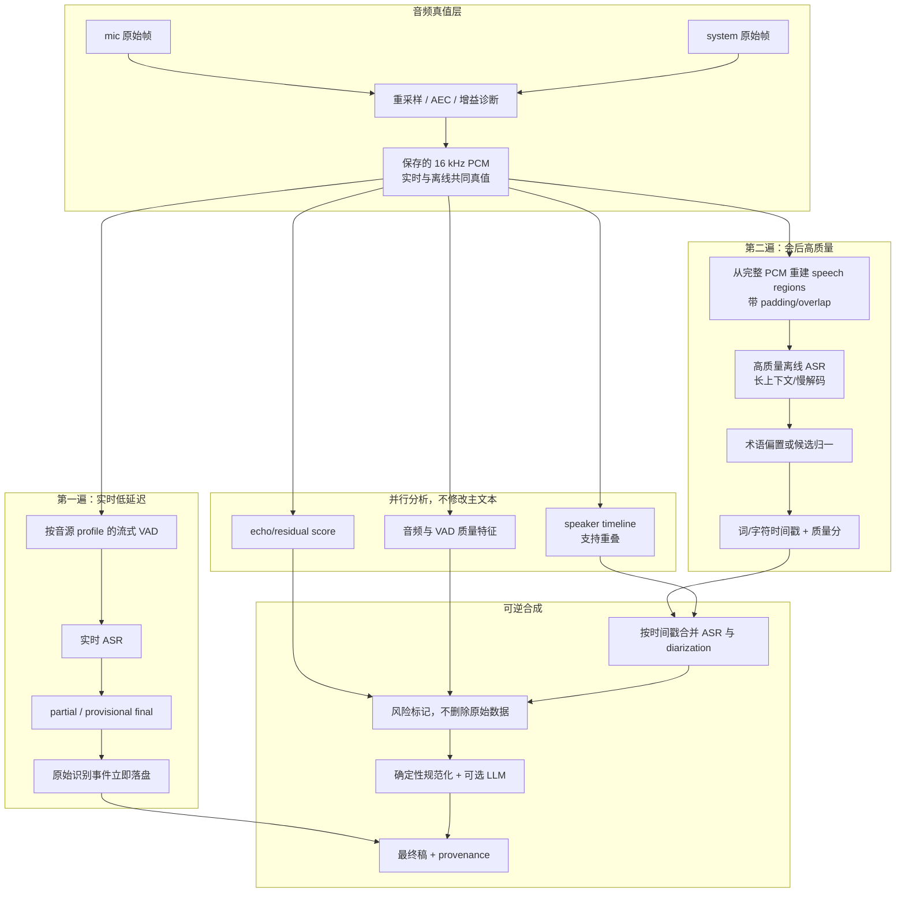

# Voice Notes ASR 系统提升方案

> 状态：调研与方案稿  
> 日期：2026-07-23  
> 范围：本地优先的中文会议转写，包括音频采集、AEC、VAD、ASR、上下文偏置、说话人分离、后处理、评测和发布机制。

## 1. 执行摘要

当前系统的问题不能通过“把 SenseVoice 换成另一个模型”完整解决。用户看到的最终错误由六层共同产生：

1. 采集和回声处理可能损伤语音；
2. VAD 可能漏掉句首句尾或切在词中；
3. ASR 缺少领域上下文，专名和同音词不稳定；
4. 段内说话人切分可能触发短子段重识别；
5. 语言、回声和低 RMS 规则会静默删除真实文本；
6. 没有端到端评测集，无法判断每层贡献和回归。

行业内更可靠的架构不是“单模型 + 多个硬过滤阈值”，而是：

```text
实时第一遍：低延迟、稳定地产生预览
              ↓
原始结果立即持久化，永不静默删除
              ↓
离线第二遍：完整上下文识别 / 重打分 / 词级时间戳
              ↓
独立说话人时间线 + 风险评分 + 术语归一
              ↓
可逆合成最终稿，并保留所有来源和修改记录
```

建议的目标架构是“实时预览 + 会后高质量第二遍”的双通道方案：

- 实时层继续使用本地小模型，优先保证延迟与稳定性；
- 停录后从保存的 16 kHz 音频重新执行高质量 ASR，不复用被实时 VAD 切碎的文本；
- 主文本只由 ASR 产生，diarization 只回答“谁在什么时候说话”，通过词级时间戳合并；
- 所有过滤从“删除”改为“风险标记”，原始段始终可恢复；
- 建立项目自己的中文会议评测集，以 CER、漏句率、实体召回率、误删率和实时系数决定模型与参数。

不建议现在直接做大规模模型迁移。第一优先级是建立评测和无损数据链路；否则更换模型后仍无法证明是否改善。

## 2. 当前系统基线

当前完整流程见 [ASR 全链路流程图](./asr-pipeline.md)。核心实现包括：

| 层 | 当前实现 | 主要限制 |
|---|---|---|
| 输入 | mic + system 双路采集 | 设备和模式差异没有进入质量模型 |
| 统一格式 | 单声道、流式重采样到 16 kHz | 只有最终 RMS，缺少削波、噪声底等诊断 |
| AEC | VPIO 或 WebRTC AEC3 + 延迟对齐 | 后续仍用固定 RMS 阈值判断残渣 |
| VAD | Silero，固定 threshold/min/max duration | mic/system/AEC 模式共用同一参数 |
| ASR | SenseVoice 默认，可选 Paraformer/Whisper | 无解码级热词、无场景上下文、无质量置信度 |
| 段内说话人 | 声纹滑窗找边界，token 分组；缺时间戳时重识别 | diarization 可能反向损伤主文本 |
| 回声/语言过滤 | 固定阈值，命中后丢弃 | 实时误删不可恢复，参数尚未系统校准 |
| 会后精修 | 短段过滤、离线重聚类、可选 LLM | 原始 ASR 不会做高质量第二遍；LLM 默认关闭 |
| 测试 | 少量短音频冒烟 | 没有 CER/WER、漏句率和实体指标；模型测试默认 ignored |

## 3. 行业方案调研

### 3.1 双遍识别：实时与最终稿分离

业界常见做法是第一遍提供低延迟结果，第二遍使用完整音频上下文或更强模型重打分。Google 的端侧两遍识别研究指出，第一遍生成实时假设，第二遍使用完整序列上下文重打分，可以取得更好的速度与质量平衡；后续研究也继续采用 streaming first pass + second-pass rescoring 的结构。[Parallel Rescoring with Transformer for Streaming On-Device Speech Recognition](https://arxiv.org/abs/2008.13093)、[Joint Audio/Text Training for Transformer Rescorer](https://arxiv.org/abs/2211.00174)

另一项统一流式/非流式两遍研究在 AISHELL-1 上报告了相对 CER 改善，说明“实时先出字、句末再提高准确率”适合中文场景。[Unified Streaming and Non-streaming Two-pass End-to-end Model](https://arxiv.org/abs/2012.05481)

对本项目的含义：

- 实时文本不应被视为最终事实；
- 停录后应从保存音频重新识别，而不是只对实时文本做 LLM 修字；
- 第二遍可以更换模型、使用更长上下文和更慢的解码策略；
- 最终稿必须能追溯到第一遍、第二遍和人工修改。

### 3.2 上下文偏置与自定义词汇

商业 ASR 普遍提供 PhraseSet、CustomClass 或 custom vocabulary，用于提高人名、产品名、机构名和领域词的召回率。Google Cloud 的官方适配文档明确支持 phrase set、custom class 和 boost；AWS 也将 custom vocabulary 与 custom language model 作为领域适配能力。[Google Speech-to-Text model adaptation](https://docs.cloud.google.com/speech-to-text/docs/adaptation-model)、[Amazon Transcribe service card](https://docs.aws.amazon.com/pdfs/ai/responsible-ai/transcribe-speech-recognition/transcribe-speech-recognition.pdf)

sherpa-onnx 已支持热词，但限制很关键：只有 Transducer 模型配合 `modified_beam_search` 才支持，SenseVoice、普通 Paraformer、Whisper 等模型不能直接使用这条热词链。[sherpa-onnx Hotwords](https://k2-fsa.github.io/sherpa/onnx/hotwords/index.html)

Paraformer 生态存在专门的热词模型 SeACo-Paraformer；论文和 FunASR 都把热词定制作为工业识别的重要能力。[SeACo-Paraformer](https://arxiv.org/abs/2308.03266)、[FunASR](https://github.com/modelscope/FunASR)

对本项目的含义：

- 短期不能把“给现有 SenseVoice 加热词”当作简单配置任务；
- 应先建立统一术语库，供确定性归一和 LLM 使用；
- 若需要真正的解码级热词，应评测 sherpa-onnx 中文 Zipformer Transducer 或接入支持热词的 FunASR/SeACo 路径；
- 热词分数必须通过实体召回率和普通词误触发率共同校准，不能无限提高 boost。

### 3.3 VAD：按数据集校准，而不是固定默认值

Silero 官方实现说明，`threshold`、最短语音、最短静音都应按具体数据集调优；官方工具支持语音概率、负阈值滞回、边界 padding，并在超长段时优先使用有效静音切点。[Silero VAD 参数实现](https://github.com/snakers4/silero-vad/blob/master/src/silero_vad/utils_vad.py)、[Silero VAD 调参 FAQ](https://github.com/snakers4/silero-vad/wiki/FAQ)

Silero 官方质量页也按 AliMeeting、AISHELL-4、VoxConverse 等会议/多人数据集分别报告性能，并强调阈值应匹配数据域。[Silero VAD Quality Metrics](https://github.com/snakers4/silero-vad/wiki/Quality-Metrics)

对本项目的含义：

- mic、system、VPIO mic、普通 mic + 软件 AEC 至少应有不同 profile；
- VAD 输出应保存概率轨迹或关键统计，便于定位漏检；
- 句首句尾需要 padding，降低切字风险；
- 超长段切分应保留前后重叠，并在第二遍中做文本去重；
- 参数选择要优化“语音召回率 + 边界误差”，不能只看是否能切出段。

### 3.4 AEC：使用回声控制器状态，不用固定音量猜测

WebRTC Audio Processing Module 将 AEC、增益控制、噪声抑制、残余回声检测分成独立组件。AEC3 本身支持外部 buffer delay、泄漏状态和指标采集，而不是只根据处理后 RMS 决定是否仍有回声。[WebRTC Audio Processing Module](https://webrtc.googlesource.com/src/%2B/refs/heads/main/modules/audio_processing/)、[EchoCanceller3 API](https://webrtc.googlesource.com/src/%2B/master/modules/audio_processing/aec3/echo_canceller3.h)

对本项目的含义：

- 应记录 AEC delay、收敛/泄漏状态、ERLE 或可获得的等价指标；
- 回声风险应由音频相关性、时间对齐、AEC 状态、近端/远端能量共同产生；
- ASR 文本相似度只能作为辅助，不应作为主要删除依据；
- `RMS <= 0.012` 不能跨设备直接决定丢弃，应改为会话内相对指标；
- 当 AEC 未收敛时，可以标记低可信片段，但仍要保存文本和音频。

### 3.5 说话人分离：与 ASR 并行，再按词时间戳合并

NVIDIA NeMo 将 ASR 的“说了什么”和 diarization 的“谁在什么时候说”定义为两个不同任务，并提供通过词级时间戳将两者合并的配置。NeMo 还强调对话中的短反馈词只有几百毫秒，粗粒度时间戳会增加文本与说话人匹配错误。[NeMo Speaker Diarization](https://docs.nvidia.com/nemo-framework/user-guide/24.07/nemotoolkit/asr/speaker_diarization/intro.html)、[NeMo Diarization Models](https://docs.nvidia.com/nemo-framework/user-guide/24.07/nemotoolkit/asr/speaker_diarization/models.html)

pyannote 的标准流水线也将 speech activity、speaker change、overlapped speech 和 speaker embedding 作为独立模块；其公开基准在 AISHELL-4、AliMeeting、AMI 等会议数据集上使用 DER 衡量说话人结果。[pyannote.audio](https://github.com/pyannote/pyannote-audio)

对本项目的含义：

- 完整 VAD 段应只做一次主 ASR；
- diarization 单独输出可重叠的 speaker timeline；
- 用词级或字符级时间戳把文本映射给说话人；
- 缺少时间戳时降级为段级标签，不应重新切音频做短段 ASR；
- 重叠说话应表示为重叠，而不是强行删除其中一人；
- 说话人质量使用 DER/JER，文本与说话人联合质量增加 cpWER 或 WDER。

### 3.6 置信度、风险评分与可逆处理

成熟 ASR 会输出词或句级置信度，用于决定是否自动采用结果、要求复核或比较多个候选。Apple 的研究指出，置信度需要校准，经过校准后才能跨词、跨模型可靠比较，并可用于从候选中选择更准确结果。[On Modeling ASR Word Confidence](https://machinelearning.apple.com/research/on-modeling-asr-word-confidence)

Whisper 官方实现也没有简单地把所有输出当成同等可信：它记录 `avg_logprob`、`compression_ratio`、`no_speech_prob`，并依据阈值触发解码回退。[OpenAI Whisper transcribe.py](https://github.com/openai/whisper/blob/main/whisper/transcribe.py)

对本项目的含义：

- `is_hallucination -> bool` 应升级为多信号风险评分；
- 风险结果应写入数据模型，例如 `echo_score`、`speech_score`、`asr_confidence`、`reason_codes`；
- UI 默认可以隐藏高风险段，但原始段必须可展开和恢复；
- 没有经过评测校准的分数不得称为“置信度”，只能称为 heuristic score；
- 自动删除门槛必须受误删率验收约束。

### 3.7 评测：按层拆分，中文以 CER 为主

NIST OpenASR 评测方案强调评分前必须固定文本规范化规则，否则标点、大小写、Unicode 和数字格式会污染错误率。[NIST OpenASR Evaluation Plan](https://www.nist.gov/system/files/documents/2021/08/31/OpenASR21_EvalPlan_v1_3_1.pdf)

中文缺乏天然空格边界，公开多语 ASR 工作通常报告 CER；同时只看 CER 无法体现漏句、实体、人名和说话人归属，因此会议产品需要补充任务指标。[Google USM paper](https://arxiv.org/pdf/2303.01037)

建议至少使用：

| 评测对象 | 指标 | 说明 |
|---|---|---|
| VAD | speech recall、false alarm、边界偏差、漏句率 | 优先保证不漏真实语音 |
| 中文 ASR | CER = (替换 + 删除 + 插入) / 参考字符数 | 主文本指标 |
| 中英混合 | 中文 CER + 英文 WER + code-switch 子集 | 避免总平均掩盖英文问题 |
| 实体 | exact recall / precision | 人名、项目、公司、术语、数字 |
| 幻觉 | 每小时插入字符、空白段产字率 | 衡量静音和噪声幻觉 |
| 过滤 | 误删真实语音率、漏过垃圾率 | 误删优先级高于漏过 |
| 说话人 | DER、JER | 谁在什么时候说话 |
| 联合稿 | cpWER 或 WDER | 文本是否分配给正确说话人 |
| 性能 | RTF、P50/P95 final latency、峰值内存 | 保证本地体验 |
| 精修 | 修正率、错误改写率、实体一致率 | 防止 LLM 篡改语义 |

## 4. 目标架构



### 4.1 数据原则

每个最终展示段都应保留来源关系：

```json
{
  "id": "stable-segment-id",
  "source": "mic",
  "start_ms": 12340,
  "end_ms": 16780,
  "pass1_text": "实时第一遍文本",
  "pass2_text": "会后第二遍文本",
  "display_text": "最终展示文本",
  "speaker_intervals": [{"speaker": "P1", "start_ms": 12340, "end_ms": 16780}],
  "quality": {
    "speech_score": 0.0,
    "echo_score": 0.0,
    "asr_score": null,
    "reason_codes": []
  },
  "visibility": "visible",
  "provenance": {
    "asr_model": "model-id",
    "asr_pass": 2,
    "normalized": true,
    "llm_polished": false
  }
}
```

分数字段在完成校准前只作内部 heuristic，不向用户展示百分比“置信度”。

### 4.2 识别器策略

不要预先指定赢家，使用项目评测集做 bake-off：

| 候选 | 角色 | 优点 | 主要风险 |
|---|---|---|---|
| 当前 SenseVoice full precision | 第一遍基线 | 已接入、快、中文/英文/语言与时间戳齐 | 专名与同音词弱，无解码级热词 |
| 当前 Paraformer int8 | 第一遍或第二遍候选 | 中文快、带时间戳 | 英文弱，当前普通模型无真正热词能力 |
| Whisper base/更大尺寸 | 第二遍候选 | 多语和长上下文生态成熟，有解码质量信号 | base 中文质量可能不足，CPU 成本更高 |
| sherpa-onnx Zipformer Transducer | 第一遍候选 | 支持 streaming、modified beam search 和热词 | 需要新适配与模型体积/RTF评测 |
| FireRedASR2 CTC/AED | 第二遍候选 | sherpa-onnx 已支持，中英和多种方言 | CTC 版本约 740 MB；热词与时间戳能力需实测 |
| FunASR SeACo-Paraformer | 领域版候选 | 原生面向热词定制 | 新运行时与部署复杂度，不宜首阶段直接引入 |

sherpa-onnx 当前官方列表包含中文流式 Zipformer、FireRedASR、SenseVoice、Paraformer、Whisper 等多种离线与在线模型，可在不改变“本地优先”原则下做同音频评测。[sherpa-onnx Pre-trained Models](https://k2-fsa.github.io/sherpa/onnx/pretrained_models/index.html)、[FireRedASR2 model](https://k2-fsa.github.io/sherpa/onnx/FireRedAsr/pretrained.html)

推荐决策规则：

1. 第一遍只接受在目标 Mac 上 `P95 RTF < 0.5` 且 final 延迟满足实时体验的模型；
2. 第二遍允许更慢，但目标是整场处理时间不超过音频时长的 25%；
3. 中文主集按 CER 排名，实体集按 exact recall 排名；
4. 任一模型若降低总体 CER 却显著提高删除错误或实体误触发，不得成为默认；
5. 模型包体积、内存和最低支持机型作为独立门槛，不用准确率掩盖部署成本。

上述数值是本项目建议的产品门槛，不是外部论文结论，需在真实设备上确认。

## 5. 分阶段实施计划

### Phase 0：建立评测与诊断基线

目标：能够回答“错误发生在哪一层、改动是否真的提升”。

预计投入：5–8 个工程日 + 2–4 小时人工标注。

#### 工作项

1. 建立 45–90 分钟脱敏评测集，至少包含：
   - 近场 mic；
   - 远场/低声 mic；
   - system 干净音频；
   - 外放 + AEC；
   - 中文夹英文；
   - 人名、项目名、产品名和数字；
   - 双人插话与短反馈；
   - 静音、键盘声、音乐和环境噪声。
2. 采用时间区间 + 文本 + speaker 的标注格式，原音频私有保存；仓库只保留合成夹具和评测工具。
3. 实现中文规范化：Unicode、全半角、标点、空格、数字规则固定版本。
4. 实现指标：CER、英文 WER、实体 P/R、漏句率、幻觉率、过滤误删率、RTF。
5. 在关键节点导出诊断：
   - AEC 前后 PCM；
   - VAD speech regions；
   - pass1 原始 transcript；
   - 每条过滤规则的输入、分数和决定；
   - 最终 display text。
6. CI 使用短合成/公开夹具守回归；私有真实集在本地或受控 runner 执行。

#### 验收

- 同一输入可一条命令复跑并生成 Markdown/JSON 报告；
- 每个错误能归因到 capture、VAD、ASR、filter、diarization 或 refine；
- 三个现有模型可以在相同 PCM 和相同切段上横向比较；
- 建立当前版本基线，后续 PR 必须报告相对变化。

### Phase 1：先消除不可恢复的数据损失

目标：任何规则判断错误都不再永久丢失用户发言。

预计投入：4–6 个工程日。

#### 工作项

1. `FinalSegment` 先落原始识别结果，再执行展示策略；
2. 语言过滤、回声去重、AEC 残渣、短段过滤统一改为：
   - `reason_codes`；
   - heuristic score；
   - `visible/hidden/review` 状态；
3. UI 增加“查看疑似误识别/回声段”和恢复操作；
4. `[识别失败]` 改成结构化错误状态，并允许从保存音频重试；
5. 每个过滤器增加 shadow mode：计算决定但不执行隐藏，用于评测；
6. 对老数据保持读取兼容，不强制迁移原始文件。

#### 验收

- 所有进入 ASR 的 final 都能在磁盘找到原始记录或结构化失败记录；
- 过滤误判可以恢复；
- shadow mode 与执行模式产生相同的 reason/score；
- 默认策略在评测集上的真实语音永久丢失率为 0。

### Phase 2：把 diarization 与主文本解耦

目标：改善说话人标签时，不再降低 ASR 文本质量。

预计投入：5–8 个工程日。

#### 工作项

1. 保留整段主 ASR 文本，不再因缺 token 时间戳对子段重新识别；
2. diarization 产生独立 speaker intervals；
3. 有 token/字符时间戳时按时间中心或最大重叠映射 speaker；
4. 没有时间戳时降级为段级 speaker；
5. 数据模型允许 overlap，例如同一时间区间存在两个 speaker；
6. 增加 DER、JER 和文本-说话人联合指标。

#### 验收

- 开关 diarization 不改变主文本字符序列；
- speaker 失败只影响标签，不影响文本落盘；
- 当前真实会议样本的过分裂和污染簇指标不低于既有基线；
- 短反馈和重叠发言不再通过“删除较短者”解决。

### Phase 3：按音源校准 VAD 与 AEC

目标：降低漏句、切词和低声误删。

预计投入：6–10 个工程日，取决于 AEC 指标接口暴露难度。

#### 工作项

1. 为 `system`、`vpio_mic`、`software_aec_mic` 建独立 VAD profile；
2. 记录 VAD 概率/触发统计，支持离线阈值 sweep；
3. 加 speech padding 和滞回阈值，降低句首句尾损失；
4. 超长切分增加重叠音频，第二遍按时间戳/文本去重；
5. 从 WebRTC AEC3 暴露可用的 delay、leakage、metrics；
6. 固定 RMS 阈值改为会话内特征：噪声底、近端/远端比、AEC 前后衰减、相关峰；
7. AEC 低可信时只标风险，不删除。

#### 验收

- 每个 profile 都有单独的 speech recall/false alarm/边界误差报告；
- 低声和远场子集的漏句率显著下降，且噪声幻觉不超基线；
- AEC 开关的 CER、重复率和近端语音保真可量化比较；
- 不再使用跨设备固定 RMS 作为单独删除依据。

### Phase 4：加入会后高质量第二遍 ASR

目标：实时保持快速，最终稿使用完整音频和更强模型。

预计投入：8–12 个工程日。

#### 工作项

1. 从保存的 16 kHz PCM 生成会后 speech regions；
2. 实现 `Pass2Recognizer`，输出：
   - text；
   - token/word timestamps；
   - 可获得的 logprob/no-speech 等质量信号；
   - 模型版本和参数；
3. 同音频评测 SenseVoice、Paraformer、Whisper 和至少一个新增候选；
4. 支持按设备性能选择第二遍模型；
5. pass2 完成前 UI 展示“实时稿”，完成后原子切换“最终稿”；
6. pass2 失败时保留 pass1，不阻塞停止录制；
7. 支持用户对单段或整场重新识别。

#### 验收

- 最终稿 CER、实体召回率分别优于 pass1 基线；
- pass2 失败不会丢失或覆盖 pass1；
- 最终稿每段可追溯到模型、版本、音频时间区间；
- 处理耗时和内存满足目标设备门槛。

### Phase 5：术语系统与上下文偏置

目标：系统性改善人名、项目名、公司名、缩写和数字。

预计投入：6–10 个工程日；若接入新 Transducer/SeACo 运行时，另加模型适配工作。

#### 工作项

1. 建统一术语库：canonical form、aliases、类型、语言、boost、来源和作用范围；
2. 自动候选来源：
   - 已命名说话人；
   - 历史笔记高频实体；
   - 用户手工项目术语；
   - 当前会议标题/日历参与者（若未来授权接入）；
3. 第一阶段先用于：
   - 确定性 alias 归一；
   - LLM 精修上下文；
   - 错误候选提示；
4. 评测 Zipformer Transducer + modified beam search 热词；
5. 若效果不足，再评估 SeACo-Paraformer/FunASR 运行时；
6. 为每个 boost 设置误触发测试，避免把普通同音词强改成术语。

#### 验收

- 专门实体集上的 exact recall 明显提升；
- 非实体普通语音 CER 不恶化；
- 用户能查看某个词为何被归一并撤销；
- 从历史笔记自动提取的词不会未经确认永久进入全局高 boost 列表。

### Phase 6：精修和发布闭环

目标：将模型输出安全地转为会议笔记，并保证每次发布可量化。

预计投入：5–8 个工程日。

#### 工作项

1. 将确定性处理与 LLM 分开：
   - 标点/空格/数字格式；
   - 明确 alias 归一；
   - 重复词规则；
   - LLM 同音与实体推断；
2. LLM 只能返回结构化 edit operations，必须带原文范围和修改原因；
3. 不允许 LLM 改变段数、时间线或说话人事实；
4. 增加文本 CAS、防并发覆盖和逐修改撤销；
5. 建立质量门禁和 canary：
   - 每个版本跑固定评测集；
   - 新规则先 shadow；
   - 分模型、设备、音源统计；
   - 指标恶化自动阻止默认启用。

#### 验收

- 精修的错误改写率受人工抽样门槛约束；
- 所有修改均可逐项撤销；
- ASR、过滤、diarization、精修分别有版本号；
- 发布报告包含准确率、误删率、RTF、内存和模型体积。

## 6. 推荐的近期版本范围

如果下一版本只做一轮，建议范围限定为 Phase 0 + Phase 1 + Phase 2 的核心部分：

1. 建立可复跑评测；
2. 原始 final 先落盘；
3. 所有硬删除改为风险标记；
4. diarization 不再触发子段重新 ASR；
5. 同 PCM 横评三种现有模型。

这一轮不会立刻带来最大的 CER 降幅，但会先解决最危险的真实发言丢失，并让后续每项优化都有可信数据。完成后再根据 bake-off 结果决定：

- 中文最终稿是否默认 Paraformer；
- 是否增加更大的 Whisper 或 FireRedASR 作为第二遍；
- 是否为热词迁移到 Zipformer Transducer；
- AEC/VAD 哪些阈值最值得调整。

## 7. 决策矩阵

| 决策 | 推荐 | 不推荐 | 理由 |
|---|---|---|---|
| 是否立即更换默认模型 | 先评测后决定 | 凭单场体感直接切 | 当前错误包含采集、VAD 和误删，换模型无法隔离变量 |
| 是否保留实时文本 | 保留为 pass1/provisional | pass2 覆盖后删除 | 便于故障回退和比较 |
| 是否自动删疑似回声 | 默认隐藏但保留原始 | 实时永久删除 | 误删真实发言的成本远高于暂时保留重复 |
| diarization 是否切音频重识别 | 不切，按时间戳合并 | 为了 speaker 标签重跑短段 ASR | 说话人目标不应破坏主文本 |
| 热词实现 | 先术语库，再评测 Transducer/SeACo | 假设 SenseVoice 能简单加 hotwords | sherpa-onnx 明确限制模型与解码方法 |
| VAD 配置 | 按音源 profile + 数据 sweep | 全部沿用 0.5/0.6s | 音源和处理链统计分布不同 |
| 精修策略 | 确定性规则 + 可审计 LLM edits | 让 LLM 自由重写全文 | 会议记录要求事实和可追溯性 |

## 8. 风险与边界

### 8.1 隐私

- 真实评测集不得提交公开仓库；
- 外部云模型只能作为用户显式选择，不得成为本地模式的隐藏依赖；
- 诊断日志不得记录完整会议文本，私有评测报告与产品遥测分离；
- 本地 LLM/Agent 精修仍需记录执行器和模型，但不上传内容。

### 8.2 存储

- 双遍和可追溯数据会增加元数据，但不要求长期保存两份音频；
- pass1/pass2 文本体积远小于音频，可长期保留；
- 用户关闭“保留音频”时，pass2 必须在音频删除前完成；失败后应明确告知无法重试。

### 8.3 性能

- 第二遍必须低优先级运行，避免与下一场录制争抢 CPU；
- 模型缓存需区分 pass1/pass2，设总内存预算；
- Intel Mac 与 Apple Silicon 应分别测量，不能只报告开发机数据；
- 运行中切模型只对下一场生效，保持现有安全语义。

### 8.4 模型许可与分发

- 新模型进入 manifest 前必须确认许可、下载稳定性、哈希、包体和最小运行时版本；
- 不因官方仓库“可下载”就自动认为允许产品再分发；
- 模型与应用版本解耦，评测报告必须钉死模型 checksum。

## 9. 自动化评测入口

仓库内已提供 `tools/asr_eval.py` 作为统一离线评分入口。数据集采用 JSONL，每行至少
包含 `reference`、`hypothesis`，可选 `entities`、`suppressed`、`should_suppress`。

```bash
python3 tools/asr_eval.py eval.jsonl \
  --max-cer 0.12 \
  --min-entity-recall 0.90 \
  --max-filter-fdr 0.01
```

任一指标越界时命令返回非零，可直接接入 CI 和模型 bake-off。

## 10. 完成定义

ASR 系统提升完成，不等于“新模型能出字”。至少需要满足：

- [ ] 有覆盖主要产品场景的私有标注集；
- [ ] 一条命令输出分层质量报告；
- [ ] 原始 ASR 结果不会被实时规则永久删除；
- [ ] pass1 和 pass2 可以独立失败与回退；
- [ ] diarization 开关不改变主文本；
- [ ] 术语改写可解释、可撤销；
- [ ] 新默认模型由 CER、实体召回、RTF 和内存共同决定；
- [ ] 每次发布都有固定基线与回归门禁；
- [ ] 用户能够查看疑似低质量段并从保存音频重试。

## 11. 参考资料

### ASR 与两遍识别

- [Robust Speech Recognition via Large-Scale Weak Supervision](https://arxiv.org/abs/2212.04356)
- [Paraformer: Fast and Accurate Parallel Transformer](https://arxiv.org/abs/2206.08317)
- [Unified Streaming and Non-streaming Two-pass End-to-end Model](https://arxiv.org/abs/2012.05481)
- [Parallel Rescoring with Transformer for Streaming On-Device Speech Recognition](https://arxiv.org/abs/2008.13093)
- [sherpa-onnx Pre-trained Models](https://k2-fsa.github.io/sherpa/onnx/pretrained_models/index.html)

### 上下文偏置

- [sherpa-onnx Hotwords](https://k2-fsa.github.io/sherpa/onnx/hotwords/index.html)
- [Google Speech-to-Text model adaptation](https://docs.cloud.google.com/speech-to-text/docs/adaptation-model)
- [SeACo-Paraformer](https://arxiv.org/abs/2308.03266)
- [FunASR](https://github.com/modelscope/FunASR)

### VAD、AEC 与说话人

- [Silero VAD](https://github.com/snakers4/silero-vad)
- [WebRTC Audio Processing Module](https://webrtc.googlesource.com/src/%2B/refs/heads/main/modules/audio_processing/)
- [NVIDIA NeMo Speaker Diarization](https://docs.nvidia.com/nemo-framework/user-guide/24.07/nemotoolkit/asr/speaker_diarization/intro.html)
- [pyannote.audio](https://github.com/pyannote/pyannote-audio)

### 评测与置信度

- [NIST OpenASR Evaluation Plan](https://www.nist.gov/system/files/documents/2021/08/31/OpenASR21_EvalPlan_v1_3_1.pdf)
- [On Modeling ASR Word Confidence](https://machinelearning.apple.com/research/on-modeling-asr-word-confidence)
