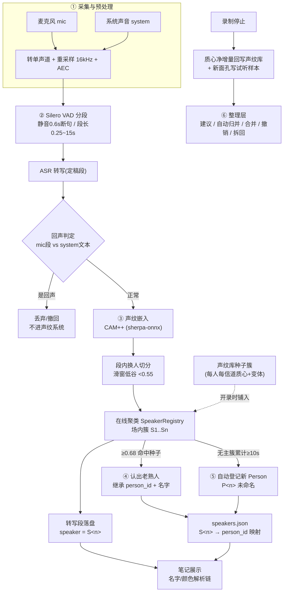
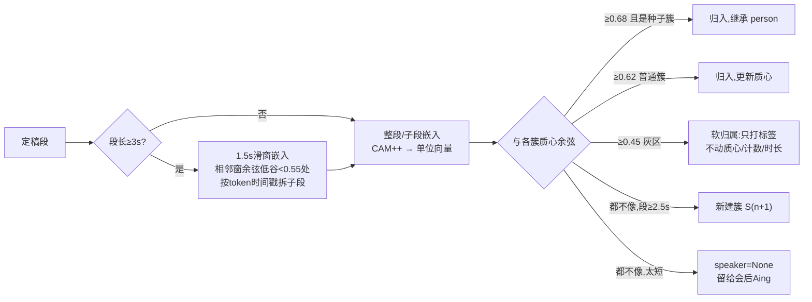
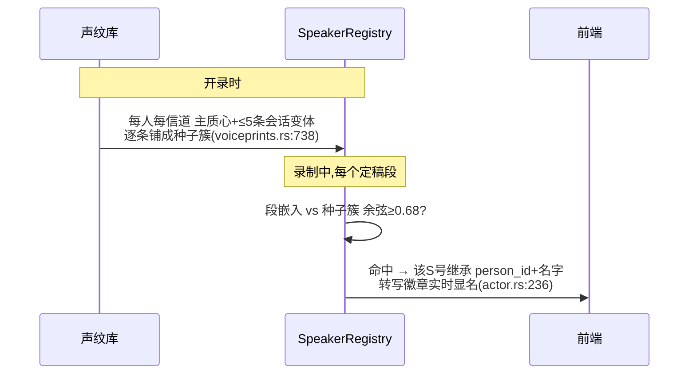
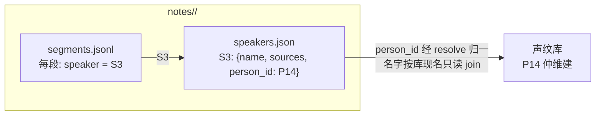

# 人物识别架构:从录音到「认出这是谁」

> 面向工程师的全链路导读:录音如何被切成段、段如何聚成说话人、说话人如何与声纹库比对、
> 转录里的徽章如何得名,以及合并/撤销/整理层如何在事后修正一切。
> 各节均附代码位置(文件:行号以写作时为准,行号漂移后按符号名检索)。

## 一图总览

## 名词表(先立共识)

| 术语 | 含义 | 生命周期 |
|---|---|---|
| **段(segment)** | VAD 切出的一段语音及其转写 | 一场会议内 |
| **簇 / S 号**(`S1..Sn`) | 场内在线聚类出的"一个声音",段落只引用它 | 一场会议内 |
| **Person / P 号**(`P1..Pn`) | 声纹库里的全局人物,编号单调分配永不复用 | 跨会议持久 |
| **质心(centroid)** | 一个人某信道声纹嵌入的加权平均单位向量,**识别的唯一依据** | 持久,随每场净增量更新 |
| **会话变体** | 每场净增量 ≥10s 时追加的一条当场质心(环形上限 5),代表"这个人不同状态的声音" | 持久 |
| **种子簇** | 开录时把库内每人的质心+变体铺进 registry 形成的"待认领"簇 | 一场会议内 |
| **样本(sample)** | 原声 WAV(≤15s),**声纹的唯一真源**(重建=样本均值) | 持久,每人上限 30 份(2026-08-29 由 10 提高) |

## ① 采集与预处理

mic 与 system 双源独立采集(`audio/mod.rs:35-46`),逐块经 `segment_worker`(`pipeline/segment_worker.rs:48-127`):转单声道 → 流式重采样到 **16kHz**(`AUDIO_SAMPLE_RATE=16_000`)→ 电平计(100ms 粒度)→ AEC(mic 默认 Apple VPIO;"保持外放音量"时换 WebRTC 软 AEC,`lib.rs:809-846`)→ 同时落盘 WAV 与送分段器。

**回声三道防线**(mic 段疑似"对方声音从音箱漏进麦克风"时,`pipeline/session.rs`):

1. **hold**:mic 段先押 2.5s(system 有在途 partial 时 ×6),等 system 定稿对质(`ECHO_HOLD_MS=2500`);
2. **击杀**:与 system 段时间相邻(<2.5s)且文本相似度 ≥0.6 → 直接丢弃,零副作用(不嵌入、不上屏、不落盘正文);
3. **撤回(retract)**:已放行的 mic 段在 30s 内被 system 定稿追认(`RETRACT_WINDOW_MS=30_000`)→ 删行 + 前端撤屏,**并回滚该段对簇质心/计数/时长的贡献**(近似逆更新,见"边界与权衡")。

## ② 分段(VAD)

Silero VAD(`pipeline/silero.rs:12-30`):`threshold 0.5`、静音 **0.6s** 断句、最短 **0.25s**、最长 **15s**(超长段在 `[70%,100%]` 区间找最低能量 100ms 窗硬切)。段带起止时间戳进单条 ASR worker,**转写定稿后**才进入说话人环节——说话人分配的单位是"定稿段"。

## ③ 场内说话人:嵌入 + 在线聚类

- **嵌入模型**:sherpa-onnx `SpeakerEmbeddingExtractor`,默认 **CAM++**(`3dspeaker_speech_campplus_sv_zh-cn_16k`),可选 ERes2NetV2(`models/mod.rs:104,119`;设置项 `settings.rs:61`)。库记录 `embedding_model`,选型不符则整场跳过种子注入(不同模型的向量空间不可比,`lib.rs:212-217`)。
- **段内换人切分**(`session.rs:330-441`):`SPLIT_MIN_SEGMENT_MS=3000 / SPLIT_WIN_MS=1500 / SPLIT_HOP_MS=500 / CHANGE_SIM_THRESHOLD=0.55 / MIN_SUBSEG_MS=1200`;时间戳缺失或切不出时回退整段——**不丢内容**是硬不变式。
- **在线聚类**(`diar/registry.rs:159-244`):判定顺序=严格阈值最优命中 → 灰区软归属 → 够长新建 → 留空。质心是单位向量 running-mean 再归一化;短于 1.5s 的段命中也**不更新质心**(`MIN_CENTROID_UPDATE_SAMPLES=24_000`),防碎片稀释。
- **mic/system 统一编号**:两路进同一个 registry,信道只记在簇的 `sources` 集合里——同一人开着外放说话,两路会归成同一个 S 号。
- **场内自我纠错**:每 8 次归簇跑一次簇间比对(`MERGE_CHECK_INTERVAL=8`),两簇 ≥**0.74** 自动合并(涉及种子簇用 0.68;不同 person 的簇**禁止**自动合并),小簇并大簇,历史段经 `merged` 事件在前端就地改写徽章(`lifecycle/actor.rs:261-286` → `recording.svelte.ts:180-188`)。
- **嵌入失败/panic 一律降级为 speaker=None,绝不影响转写文本**(`session.rs:270-282`)。

## ④ 跨会议识别(实时认人)

要点:一个人的多条质心(主+变体)各成一个种子簇,匹配等价于取 max——不同状态的声音都可能命中;种子簇阈值(0.68)比普通簇(0.62)**更严**,且**不参与软归属**——认错老熟人的代价高于漏认。识别发生在**实时**,不等停止。

种子命中还设了"三闸":①段长 <2s(`SEED_MIN_SAMPLES`)一律无权拍板,再高的裸分也只能进普通簇/软归属;②同信道走裸余弦快路(≥0.68 即中,与普通簇同款判定,只是阈值更高);③跨信道裸分不可比,只走 AS-Norm 对称 z 通道(`SEED_ASSIGN_Z=3.0` 且裸分 ≥`SEED_ASSIGN_RAW_FLOOR=0.50`)才认领——z 通道对同信道同样开放,作为召回增益。续录恢复簇与(无主↔种子)合并降级簇维持旧语义(裸 0.68 不分信道),待快照带信道后收紧。

## ⑤ 自动登记与库更新

- **登记门槛**:无主簇本场**累计发声 ≥10s**(`AUTO_ENROLL_MS=10_000`,`voiceprints.rs:20`;软归属/短段不计入累计;短段=1.5s 以下的段不更新质心也不计入这份累计,`MIN_CENTROID_UPDATE_SAMPLES`)。两条路径:实时(每条定稿后 `enroll_pending`)+ 停止兜底(`upsert_from_session`),同一门槛。
- **质心更新**:停止时按**本场净增量**(减去种子基数,防重复累加)加权并入同信道主质心并重归一;净增量 ≥10s 另追加一条会话变体(环形上限 5)。
- **试听样本**:只为"本场**新入库**的陌生声音"写一份(截 15s,够 10s 即定格);老熟人跳过(除非一份都没有)。上限 30 份(2026-08-29 前为 10),合并超额时 `select_balanced_recent` 双方按比例、各留最新。**样本是声纹的唯一真源**:人工试听核对、改归属/删除后按样本重建、换嵌入模型时重算质心(`rebuild_for_model`);嵌入按内容哈希缓存于 `voiceprints/.embed_cache.json`。

## 转录标注:S 号与 P 号的两层结构

**段落只存场内 S 号,人物关联只在 speakers.json 这一层**(`store/mod.rs:60-98`)。加载时只读 join、**绝不改盘**(`store/notes.rs:426-455`):person_id 先经 redirect 链 `resolve` 归一到合并后的人,再按库现名填充(本地改过名则本地优先)。这就是"改名/合并后历史笔记自动显示新名"的机制——**存 id 不存名**。

前端名字解析链(`notes.ts:278-290`),命中即止:

1. 本地/库名非空 → 显示名字;
2. 有 `person_id` → 「**说话人 N**」(N=全局 P 号,跨会议恒定);
3. 修订稿 `R<n>` → 「说话人 n」;
4. 未入库过渡态 → 「**新说话人 N**」(N=场内 S 号);
5. `speaker=null` → 按信道「我/对方」。

颜色按 `person_id || S号` 取 7 色调色板((n-1)%7),已关联人物**跨笔记同色**(`notes.ts:313-345`)。

**事后修正**:改单段只能改到本场另一 S 号或「新说话人」(不回灌声纹,`set_segment_speaker`);把整个 S 号指认给库中人物走「会议搭子」选人(`assign_note_speaker_person`,整场生效,person_id 先 resolve、录制中拒绝);「这是我」=改名为「我」。修订稿改名会反向同步库名,原始稿改名不同步。

## ⑥ 会后与整理层

- **会后精修**:Aing 对全场做离线 AHC 重聚类(`AHC_THRESHOLD=0.68`,`refine/recluster.rs:10-15`)出修订稿终版划分——在线聚类只是实时近似。
- **整理层**(概览页「分析说话人」):基于库内质心做再辨认。`suggest_merges`(`voiceprints.rs:895-1009`)只把**未命名者**作为待辨认主体,在**共有信道**上对(主质心+全部变体)做全组交叉余弦取 max;S-Norm 显著性 `z=((s-ma)/sa+(s-mb)/sb)/2`(cohort<3 不算)。准入 `s≥0.68 或 (z≥2.5 且 s≥0.45)`;**自动归并**(`confident_picks`)另加四道闸:`强(s≥0.74 或 z≥3.0)` ∧ loser 未命名 ∧ winner **已命名** ∧ 不在拒绝名单(方向不敏感;落库前逐条重读)。
- **合并/撤销**:合并前整套快照进合并日志(写不进就不合并);`redirects[loser]=winner` 且链条压扁一跳到底(`resolve` 上限 8 跳防环);撤销按快照还原并把 pair 落**拒绝名单**(自动归并不再犯,重启也不犯);失效条目可「拆回原身份」(只还原 loser,不动 winner,连带 deny winner 当前化身)。

## 阈值速查

| 常量 | 值 | 语义 | 位置 |
|---|---|---|---|
| `ASSIGN_THRESHOLD` | 0.62 | 归入普通簇 | registry.rs |
| `SEED_ASSIGN_THRESHOLD` | 0.68 | 归入种子簇(认老熟人,更严;同信道;跨信道走 z 通道) | registry.rs |
| `SEED_CLAIM_MARGIN` | 0.03 | 认领差距门(仅默认最近邻):最佳合格席位与另一个**有名字**人物的最佳合格席位差 < 此值即弃权、只记参考近邻(两份档案本是同一人时最近邻等于抛硬币,2026-08-28 P11/P14 事故;LOSO 校准) | registry.rs |
| `SOFT_ASSIGN_THRESHOLD` | 0.45 | 灰区软归属(不动质心) | registry.rs |
| `MERGE_THRESHOLD` | 0.74 | 场内簇间自动合并 | registry.rs |
| `MIN_NEW_CLUSTER_SAMPLES` | 2.5s | 短于此不建新簇 | registry.rs |
| `MIN_CENTROID_UPDATE_SAMPLES` | 1.5s | 短于此不更新质心 | registry.rs |
| `SEED_MIN_SAMPLES` | 2s | 段长下限,不足则无权拍板种子(待评测集校准的初值) | registry.rs |
| `SEED_ASSIGN_Z` | 3.0 | 种子 AS-Norm 对称 z 命中门槛(跨信道唯一通道;同信道亦开放为召回增益)(待评测集校准的初值) | registry.rs |
| `SEED_ASSIGN_RAW_FLOOR` | 0.50 | 种子 z 通道命中仍要求的裸分地板(待评测集校准的初值) | registry.rs |
| `AUTO_ENROLL_MS` | 10s | 自动登记新 Person 门槛 | voiceprints.rs:20 |
| `SESSION_CENTROIDS_MAX` | 5 | 会话变体环形上限 | voiceprints.rs:45 |
| `MAX_SAMPLES` | 10 | 试听样本上限 | voiceprints.rs:26 |
| `SUGGEST_MERGE_THRESHOLD` | 0.68 | 建议准入(裸余弦档) | voiceprints.rs:862 |
| `SUGGEST_Z_THRESHOLD / RAW_FLOOR` | 2.5 / 0.45 | 建议准入(显著性档) | voiceprints.rs:868-870 |
| `SUGGEST_STRONG_RAW / STRONG_Z` | 0.74 / 3.0 | "很可能"/自动归并档 | voiceprints.rs:872-875 |
| `AHC_THRESHOLD` | 0.68 | 会后离线重聚类 | refine/recluster.rs |
| `ECHO_SIM_THRESHOLD` | 0.6 | 回声文本相似度 | session.rs |
| `RETRACT_WINDOW_MS` | 30s | 回声事后撤回窗口 | session.rs |

## 边界与权衡(有意为之的,别当 bug 修)

- **样本不参与识别**:识别只靠质心。样本是人的"可听证据"与换模型重建的原料。
- **软归属不动质心**:灰区段(0.45~0.62)只打标签——宁可标注保守,不让存疑声音稀释质心。
- **不同 person 的簇禁止场内自动合并**:跨人合并只允许在整理层由人拍板(或高置信自动归并,可撤销)。
- **回声撤回的质心回滚是近似逆更新**(`c'=normalize(c·count−e)`):running-mean 逐步归一化后和向量幅值信息已丢失,簇内向量高相似时方向误差可忽略;计数/时长回滚精确。撤回只发生在录制中,停止快照因此天然干净。
- **拒绝名单只挡自动归并,不挡人工建议**:撤销/拆回过的组合仍会以普通建议卡出现,由人终审。
- **`list_speakers` 与 `person_notes` 的会议计数均经 resolve 归一**(前者曾少计已修)。
- **改名不挡录制,合并/删除/撤销/拆回录制中拒绝**(落库前还会再查一次,防"操作中开录"的种子错配)。

## 文件地图

| 模块 | 职责 |
|---|---|
| `src-tauri/src/audio/` | 双源采集、AEC、重采样 |
| `src-tauri/src/pipeline/segment_worker.rs` | 逐块预处理与分段驱动 |
| `src-tauri/src/pipeline/silero.rs` | VAD 分段 |
| `src-tauri/src/pipeline/session.rs` | 定稿链路:回声防线、段内切分、嵌入调度、快照 |
| `src-tauri/src/diar/mod.rs` | SherpaEmbedder(声纹嵌入) |
| `src-tauri/src/diar/registry.rs` | 在线聚类、种子簇、场内合并、登记候选、撤回回滚 |
| `src-tauri/src/store/voiceprints.rs` | 声纹库:Person/质心/样本/合并/撤销/拆回/建议 |
| `src-tauri/src/store/merge_journal.rs` | 合并日志:快照、失效、拒绝名单、处置名单 |
| `src-tauri/src/store/notes.rs` | 笔记落盘与只读 join(名字/归一) |
| `src-tauri/src/lifecycle/actor.rs` | 录制期事件落盘与 speakers 广播 |
| `src-tauri/src/refine/recluster.rs` | 会后 AHC 重聚类 |
| `src/lib/notes.ts` | 名字解析链、调色板 |
| `src/lib/recording.svelte.ts` | 实时事件消费(SpeakerMap/merged) |
| `src/routes/speakers/` | 会议搭子:概览/整理/详情 |

## 2026-08-29 单均值宪法(Codex 复审后收口)

P11 事故(一次手动误合并 + 三次自动归并 + 两次自动回灌,把用户本人的声音滚成「郑超敏」整档)之后,把"错误会自我强化"的传播链从代码层切断:

| 路径 | 之前 | 现在 |
|---|---|---|
| 入库 / 纠错回灌(`upsert_from_session`、`reinforce_feedback`) | 加权并入主质心 **+ 追加一份会话变体** | 只加权并入主质心 |
| 合并(`merge_locked`) | loser 主质心降级为 winner 变体、loser 变体全部带过来 | 只加权并入;命令层合并后 **按样本重建 winner**(`rebuild_person_blocking`) |
| 合并超额淘汰 | farthest-point 留"彼此最不像"的 10 份(偏爱错人/噪声样本) | `select_balanced_recent`:双方按比例、各留最新;淘汰件在合并日志有副本 |
| 种子注入(`seed_clusters`) | 主质心 + 全部会话变体各一席,取 max | **只取主质心**;`seed_clusters_with_variants` 仅评测对照 |
| 自动归并(`apply_confident_merges`) | strong 档自动落库 | 永不落库,只出建议(`applied` 恒空) |

结论:一个人的声纹 = 其样本 wav 嵌入的归一化均值,别无其他状态。要改一个人的声纹,改他的样本(删/归到别人/确认新场次),不存在"库里悄悄多了一份质心"的路径。多质心/条件分层等长尾方案,须在清库 + 按时间切分的 enrollment→未来会议评测(含陌生人探针)搭起来之后再议。

### 多质心匹配(2026-08-29,实验,默认关)

用户判断:环境/设备差异大,单均值"离哪个都不近"。机制已搭好,设置「说话人识别方法」第三档 `multi_centroid`:

- 按样本重建时(`rebuild_person_from_samples` / `rebuild_for_model`)把该人样本按平均连接层次聚类(`cluster_sub_centroids`,合并阈值 `SUB_CENTROID_LINK_THRESHOLD=0.55`),**支撑 ≥ `SUB_CENTROID_MIN_SUPPORT`=3 份的簇**各写一个 `Person::sub_centroids`;全部聚成一簇则不写(等于主质心)。
- 子质心是样本的确定性函数,没有独立写入口——这是与已废弃的 `session_centroids` 的本质区别:变体可被一份脏样本单独劫持,子质心要 3 份同向的错样本才会。
- 只在识别方法为 `multi_centroid` 时 `seed_clusters_multi` 才把子质心当席位(同人取 max);差距门照常作用于人级最佳席位。
- 评测:`speaker_loso_eval <root> <onnx> --multi` 与默认单均值并排比。2026-08-29 现状:76 位有名字的人里 35 人只有 1 份样本、仅 7 人 ≥6 份,子质心几乎无从形成——**此开关的价值要等上限 30 之后样本攒起来**;届时先跑评测再决定是否默认开启。

### 样本 ↔ 会议双向同步(2026-08-29)

样本文件与笔记说话人簇是同一段声音的两份记录,改一边另一边跟着走:
- 人物页**归到别人 / 删除样本** → 来源会议里产出这份样本的簇改派给目标 / 解除关联(`sync_note_links_for_sample`;溯源真值只动那一簇,按时间推断的来源动该场所有关联到该人的簇;录制中的笔记跳过)。
- 笔记页**改派 / 解除说话人** → 旧人从这簇截的样本退掉并按样本重建旧人(`retire_traced_samples_async`,仅有溯源真值的样本;无名旧人走 MergePrior 整人并入,不在此处理)。

